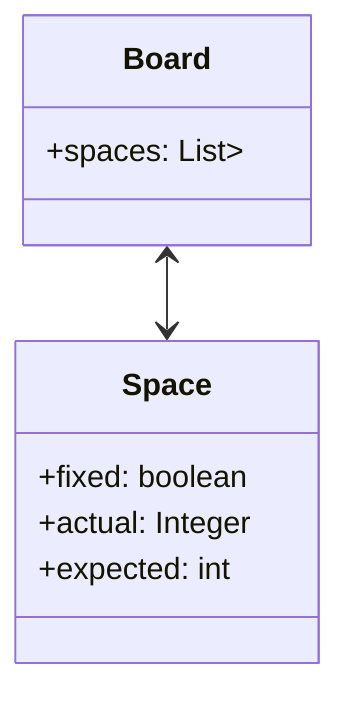

# 🧩 Jogo de Sudoku em Java

## 📌 Descrição

Este projeto é um jogo de **Sudoku** desenvolvido em **Java**, com execução e interação totalmente via terminal. O objetivo é oferecer uma experiência prática e educativa, focando no uso da **Programação Orientada a Objetos (POO)**, **manipulação de estruturas de dados** e **entrada/saída de dados no console**.

Este jogo foi desenvolvido como parte de um desafio da DIO (Digital Innovation One), com foco na consolidação de conceitos fundamentais da linguagem Java.

## 🎯 Funcionalidades

- Iniciar um novo jogo com uma grade personalizada.
- Inserir um número em uma posição específica.
- Remover números da grade.
- Visualizar o estado atual do tabuleiro.
- Verificar se o jogo foi resolvido corretamente.
- Limpar o jogo atual.
- Finalizar ou sair do jogo.

## 🧠 Conceitos Aplicados

- Programação Orientada a Objetos (POO)
- Uso de classes, métodos e encapsulamento
- Manipulação de `Scanner` para entrada de dados
- Estruturas de repetição e condicionais
- Validação de regras do Sudoku

### 🔧 Tecnologias utilizadas:

* Java
* UML (com Mermaid)

### 🖋️ Diagrama de Classes (UML)

